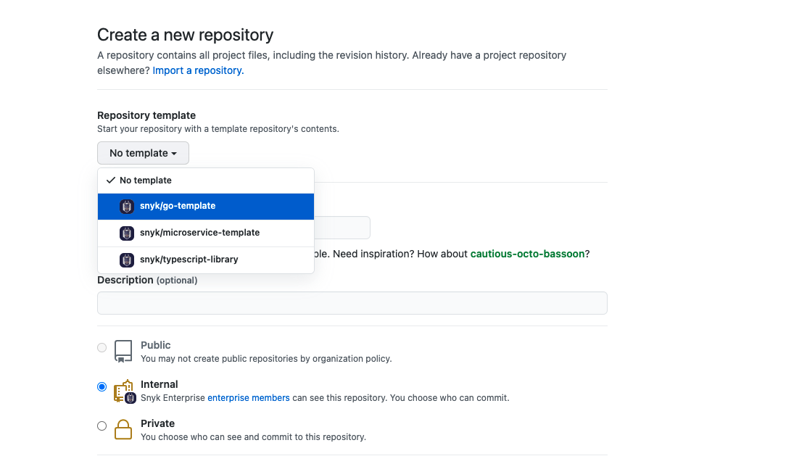

# go-template

The go-template is a template repo for golang project. it provides basic golang project structure and files
for quick kickstart of golang project.

## usage

<br><br>

## Dependency management
```
go mod init github.com/snyk/<project name>
go mod tidy
```

## Content
- folders layout 
- basic make file
- linter with configuration
- docker file 
- circle-ci config file
- test helper
- release config file


Note : Not all folders must use , one can be deleted if not needed 